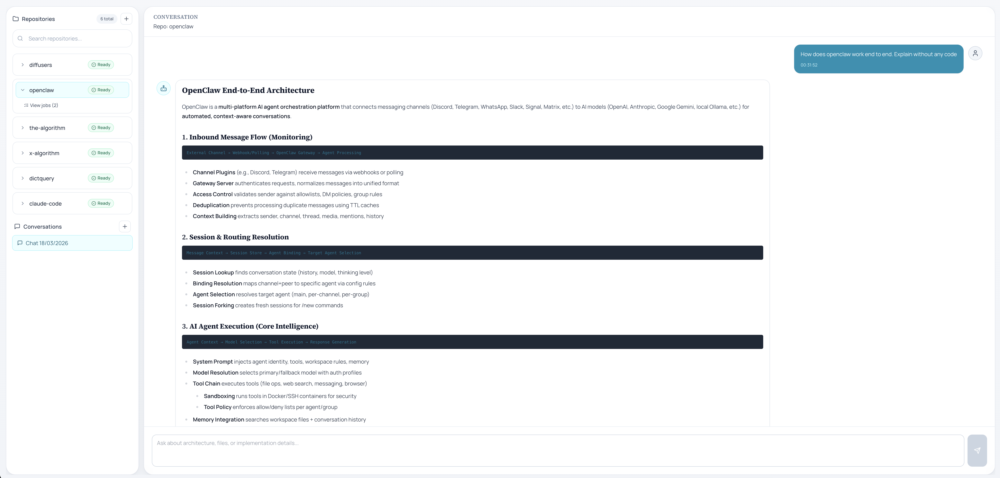

## **Code Sense UI - Repository Chat & Ingestion Dashboard**



A React-based interface for managing code repository ingestion and AI-powered chat interactions.

### **Features**

- 📁 **Repository Management** - Browse, ingest, and delete code repositories
- 💬 **AI Chat** - Context-aware conversations about your codebase
- 🔄 **Repository Ingestion** - Queue local repository paths from the UI
- 📊 **Job Monitoring** - Real-time tracking of ingestion pipeline stages
- 🗂️ **Conversation History** - Persistent chat sessions per repository


### **Setup**

1. **Install dependencies:**
   ```bash
   npm install
   ```

2. **Configure environment:**
   
   Create `.env.local`:
   ```env
   VITE_API_BASE=http://localhost:8000
   ```

3. **Run development server:**
   ```bash
   npm run dev
   ```
   
   App runs at `http://localhost:5173`

4. **Build for production:**
   ```bash
   npm run build
   ```

### **Usage**

#### **Ingest Repositories**
1. Click **+** next to "Repositories" in sidebar
2. Browse configured local roots and select a git repository folder
3. Optionally enter a display key
4. Click **Ingest Selected**
5. Monitor ingestion progress in "Ingestion Jobs" section

#### **Chat with Repository**
1. Select a repository from sidebar
2. Click **+ New Chat** or select existing conversation
3. Ask questions about the codebase

#### **Manage Jobs**
- **View details**: Click on any job to see pipeline stages and metrics
- **Delete**: Remove completed/failed/cancelled jobs


### **API Endpoints**

- `GET /repos` - List repositories
- `POST /ingest` - Start a single repository ingestion job
- `GET /status` - Job status & listing
- `DELETE /jobs/{job_id}` - Delete job
- `POST /conversations` - Create chat session
- `POST /chat` - Send message (streaming)
- `GET /conversations` - List conversations
- `DELETE /conversations/{id}` - Delete conversation

### **Environment Variables**

| Variable | Description | Default |
|----------|-------------|---------|
| `VITE_API_BASE` | Backend API URL | `http://localhost:8000` |


### **Notes**

- Local repository paths must be accessible to the backend API process
- Folder browsing uses `GET /local/repos/browse` from the backend, so roots are controlled by the API
- Job statuses: `queued`, `running`, `completed`, `failed`, `cancelled`
- The ingest modal starts one repository ingestion at a time
